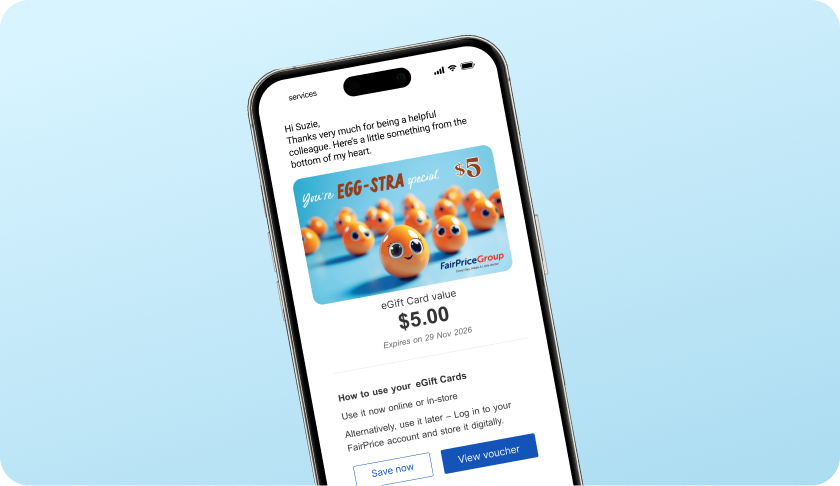

# Delivery Cards Section Update

## Overview
The "Gifting made practical, easy and meaningful" section (formerly "Choose your preferred delivery method") has been redesigned to match the reference layout with prominent image-based cards.

## New Design

### Visual Layout

```
┌─────────────────────────────────────────────────────────────────────┐
│          Gifting made practical, easy and meaningful                │
│                      (Dark Teal Background)                         │
│                                                                     │
│  ┌──────────────────────────┐    ┌──────────────────────────┐    │
│  │ ┌──────────────────────┐ │    │ ┌──────────────────────┐ │    │
│  │ │  Light Blue Area     │ │    │ │  Light Blue Area     │ │    │
│  │ │  [Mobile Phone IMG]  │ │    │ │  [Physical Cards]    │ │    │
│  │ └──────────────────────┘ │    │ └──────────────────────┘ │    │
│  │                          │    │                          │    │
│  │ eGift Cards              │    │ Physical Gift Cards      │    │
│  │ Best for speed and...    │    │ Best for in-person...    │    │
│  │                          │    │                          │    │
│  │ • Instant/scheduled...   │    │ • Available for...       │    │
│  │ • Personal or bulk...    │    │ • Bulk delivery...       │    │
│  │ • The thoughtful...      │    │ • Great for...           │    │
│  │                          │    │                          │    │
│  │ [Send eGift card]        │    │ [Find a store]           │    │
│  └──────────────────────────┘    └──────────────────────────┘    │
└─────────────────────────────────────────────────────────────────────┘
```

## Changes Made

### 1. **Section Heading Updated**

**Before**: "Choose your preferred delivery method"
**After**: "Gifting made practical, easy and meaningful"

```html
<h2 class="text-center text-3xl font-bold text-white mb-10">
  Gifting made practical, easy and meaningful
</h2>
```

### 2. **Background Color**

**Before**: `bg-brand-dark` (navy blue)
**After**: `bg-[#134E5A]` (dark teal)

Matches the reference design exactly.

### 3. **Card Structure with Images**

**New Layout**:
```html
<article class="delivery-card">
  <!-- Light Blue Image Area -->
  <div class="bg-[#D4EFF7] p-8 min-h-[280px]">
    
  </div>
  
  <!-- White Content Area -->
  <div class="p-8">
    <h3>eGift Cards</h3>
    <p>Best for speed and convenience</p>
    <ul>
      <li>• Instant/scheduled delivery via Email</li>
      <li>• Personal or bulk sending</li>
      <li>• The thoughtful gift for every need...</li>
    </ul>
    <button>Send eGift card</button>
  </div>
</article>
```

### 4. **Updated Content**

#### eGift Cards
```javascript
{
  title: "eGift Cards",
  description: "Best for speed and convenience",
  image: "eGiftCards.png",
  bullets: [
    "Instant/scheduled delivery via Email",
    "Personal or bulk sending",
    "The thoughtful gift for every need, from a simple "thank you" to major milestones and celebrations"
  ],
  action: "Send eGift card"
}
```

#### Physical Gift Cards
```javascript
{
  title: "Physical Gift Cards",
  description: "Best for in-person moments",
  image: "pGiftCards.png",
  bullets: [
    "Available for in-store collection (personal gifting) or bulk delivery (corporate gifting)",
    "Bulk delivery requires a minimum spend and 5-7 working days lead time",
    "Great for everything from birthday gifts to corporate employee benefits"
  ],
  action: "Find a store"
}
```

### 5. **Image Backgrounds**

Light blue background (#D4EFF7) for image areas:

```css
.delivery-card-image {
  background-color: #D4EFF7;
  display: flex;
  align-items: center;
  justify-content: center;
  min-height: 280px;
  padding: 2rem;
}
```

### 6. **Button Styling**

Updated to match reference:

```html
<button class="border-2 border-brand-dark px-6 py-2.5 
               text-brand-dark hover:bg-brand-dark hover:text-white">
  Send eGift card
</button>
```

**Features**:
- 2px border (dark navy)
- No background initially
- Hover: Dark navy background with white text
- No border-radius (square corners)

## Required Images

### Image Files

Place these in `/workspace/src/assets/images/`:

| File | Content | Size |
|------|---------|------|
| **eGiftCards.png** | Mobile phone displaying eGift card with "$5.00 EGG-STRA special" message | ~800x600px |
| **pGiftCards.png** | Physical gift cards showing "$20 LETTUCE celebrate you!" with blue envelope | ~800x600px |

### Image Specifications

- **Format**: PNG with transparency (optional)
- **Dimensions**: ~800x600px (4:3 ratio)
- **Background**: Transparent or white (will be displayed on light blue)
- **Content**: Full product mockup shots
- **Quality**: High resolution for retina displays

## CSS Styling

### Card Styles

```css
.delivery-card {
  overflow: hidden;
  border-radius: 1rem;
  background: white;
  box-shadow: 0 4px 16px rgba(0, 0, 0, 0.1);
  transition: transform 0.3s ease, box-shadow 0.3s ease;
}

.delivery-card:hover {
  transform: translateY(-4px);
  box-shadow: 0 12px 32px rgba(0, 0, 0, 0.15);
}

.delivery-card-image {
  background-color: #D4EFF7;
  padding: 2rem;
  display: flex;
  align-items: center;
  justify-content: center;
  min-height: 280px;
}

.delivery-card-image img {
  max-height: 240px;
  max-width: 100%;
  object-fit: contain;
}
```

## Typography

### Headings
```css
h3: text-2xl font-bold text-brand-dark
p (description): text-base font-semibold text-slate-900
```

### Bullets
```css
li: text-sm text-slate-700 leading-relaxed
```

## Responsive Behavior

### Mobile (< 1024px)
```css
/* Single column, stacked cards */
.grid.lg:grid-cols-2 {
  grid-template-columns: 1fr;
  gap: 2rem;
}
```

### Desktop (≥ 1024px)
```css
/* Two columns, side by side */
.grid.lg:grid-cols-2 {
  grid-template-columns: repeat(2, minmax(0, 1fr));
  gap: 2rem;
}
```

## Color Palette

| Element | Color | Hex |
|---------|-------|-----|
| **Section Background** | Dark Teal | #134E5A |
| **Card Background** | White | #FFFFFF |
| **Image Area Background** | Light Blue | #D4EFF7 |
| **Heading Text** | White | #FFFFFF |
| **Card Title** | Brand Dark | #02335D |
| **Body Text** | Slate Gray | #334155 |
| **Button Border** | Brand Dark | #02335D |

## Before vs After Comparison

### Before
```html
<!-- Simple card with gradient preview box -->
<article class="rounded-2xl border bg-white p-6">
  <div class="delivery-preview delivery-egift"></div>
  <h3>eGift Cards</h3>
  <p>Best for speed and convenience</p>
  <ul>
    <li>Instant purchase and delivery to email</li>
    ...
  </ul>
  <button>Send eGift now</button>
</article>
```

**Issues**:
- No visual imagery
- Generic gradient boxes
- Less engaging
- Smaller cards

### After
```html
<!-- Image-rich card with product photos -->
<article class="delivery-card">
  <div class="bg-[#D4EFF7] p-8 min-h-[280px]">
    
  </div>
  <div class="p-8">
    <h3>eGift Cards</h3>
    <p>Best for speed and convenience</p>
    <ul>
      <li>Instant/scheduled delivery via Email</li>
      ...
    </ul>
    <button>Send eGift card</button>
  </div>
</article>
```

**Benefits**:
- Real product imagery
- More visual appeal
- Professional mockups
- Larger, more prominent
- Better hierarchy

## HTML Structure

```html
<section class="bg-[#134E5A] py-16">
  <div class="mx-auto max-w-6xl px-4">
    <h2 class="text-center text-3xl font-bold text-white mb-10">
      Gifting made practical, easy and meaningful
    </h2>
    
    <div id="delivery-cards" class="grid gap-8 lg:grid-cols-2">
      
      <!-- eGift Card -->
      <article class="delivery-card overflow-hidden rounded-2xl bg-white shadow-lg">
        <div class="delivery-card-image bg-[#D4EFF7] p-8 min-h-[280px]">
          
        </div>
        <div class="p-8">
          <h3 class="text-2xl font-bold text-brand-dark">eGift Cards</h3>
          <p class="mt-2 text-base font-semibold">Best for speed and convenience</p>
          <ul class="mt-6 space-y-3 text-sm">
            <li>• Instant/scheduled delivery via Email</li>
            <li>• Personal or bulk sending</li>
            <li>• The thoughtful gift for every need...</li>
          </ul>
          <button class="mt-8 border-2 border-brand-dark px-6 py-2.5">
            Send eGift card
          </button>
        </div>
      </article>
      
      <!-- Physical Gift Card -->
      <article class="delivery-card">
        <!-- Similar structure -->
      </article>
      
    </div>
  </div>
</section>
```

## Files Modified

| File | Changes |
|------|---------|
| `src/js/data/content.js` | Added image field, updated bullets and copy |
| `src/js/components/renderers.js` | Completely rewrote renderDeliveryCards() |
| `index.html` | Updated section heading and background color |
| `src/css/styles.css` | Added delivery card styles and hover effects |
| `src/assets/images/README.md` | Added delivery card image requirements |

## Features

### ✅ Visual Appeal
- Real product imagery
- Professional mockups
- Light blue image backgrounds
- Clean white content areas

### ✅ Layout
- Prominent cards with images
- Clear visual hierarchy
- Generous spacing
- Two-column desktop layout

### ✅ Content
- Updated bullet points
- Clearer descriptions
- Specific details about each option
- Actionable CTAs

### ✅ Interaction
- Hover effects (lift + shadow)
- Smooth transitions
- Clear focus states
- Accessible buttons

### ✅ Branding
- Dark teal background
- Light blue image areas
- Navy buttons
- Consistent with reference

## Testing Checklist

- [ ] Place image files in `/workspace/src/assets/images/`
  - [ ] eGiftCards.png
  - [ ] pGiftCards.png
- [ ] Verify images display correctly
- [ ] Check light blue backgrounds
- [ ] Test hover effects on cards
- [ ] Verify button styling (no border-radius)
- [ ] Check responsive layout (1 col mobile, 2 cols desktop)
- [ ] Test on different screen sizes
- [ ] Verify text readability on dark background
- [ ] Check spacing and alignment

## Browser Compatibility

✅ Chrome/Edge 90+  
✅ Firefox 88+  
✅ Safari 14+  
✅ Mobile browsers (iOS Safari, Chrome Mobile)

## Summary

The delivery cards section has been completely redesigned:
- ✅ **New heading**: "Gifting made practical, easy and meaningful"
- ✅ **Dark teal background**: Matches reference exactly
- ✅ **Image-based cards**: eGiftCards.png and pGiftCards.png
- ✅ **Light blue image areas**: #D4EFF7 background
- ✅ **Updated content**: New bullet points and copy
- ✅ **Larger cards**: More prominent and engaging
- ✅ **Squared buttons**: No border-radius
- ✅ **Hover effects**: Lift and shadow animations

All changes committed and pushed to main branch! 🚀
