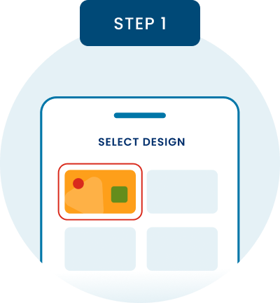
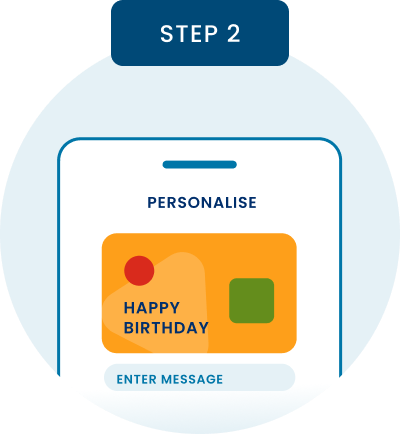
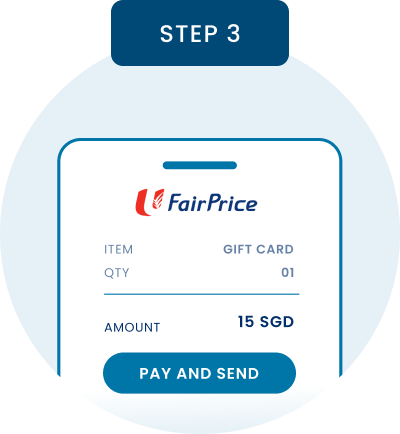

# eGift Knowledge Section Update

## Overview
The "All you need to know about eGift Cards" section has been completely redesigned to match the reference layout with prominent mobile phone mockups, coded step badges, and circular backgrounds.

## New Design

### Visual Layout

```
┌─────────────────────────────────────────────────────────────────────┐
│     All you need to know about eGift Cards                          │
│                              ─────                                  │
│                                                                     │
│  [How to order]  [How to use]  [How to view]                       │
│  ───────────────                                                    │
│                                                                     │
│  ┌────────────┐     ┌────────────┐     ┌────────────┐            │
│  │  STEP 1    │     │  STEP 2    │     │  STEP 3    │            │
│  └────────────┘     └────────────┘     └────────────┘            │
│       ○               ○               ○                           │
│     ╱   ╲           ╱   ╲           ╱   ╲                         │
│    │ 📱  │         │ 📱  │         │ 📱  │                        │
│     ╲   ╱           ╲   ╱           ╲   ╱                         │
│       ○               ○               ○                           │
│                                                                     │
│  Select Design   Personalise    Pay and send                       │
│  Pick from a...  Choose the...  Create your...                     │
└─────────────────────────────────────────────────────────────────────┘
```

## Changes Made

### 1. **Heading with Underlined "eGift"**

```html
<h2 class="text-center text-3xl font-bold text-brand-dark mb-8">
  All you need to know about 
  <span class="underline decoration-4 decoration-brand underline-offset-8">
    eGift
  </span> 
  Cards
</h2>
```

**Features**:
- Underline on "eGift" only
- 4px thick underline
- Brand color (#0057A3)
- 8px offset from text

### 2. **Tab Navigation Redesign**

**Before**: Rounded tab buttons with background
```html
<button class="tab-button">How to order</button>
```

**After**: Clean tabs with bottom border indicator
```html
<button class="egift-tab-button">
  How to order
  <span class="tab-underline"></span> <!-- Active tab only -->
</button>
```

**Tab States**:
- **Active**: Dark navy text + brand color underline
- **Inactive**: Gray text
- **Hover**: Dark navy text

### 3. **Step Cards with Images**

**New Structure**:
```html
<article class="egift-step-card">
  <!-- Coded Step Badge -->
  <div class="step-badge bg-brand-dark">
    Step 1
  </div>
  
  <!-- Circular Background with Image -->
  <div class="step-circle bg-[#D4EFF7]">
    
  </div>
  
  <!-- Title & Description -->
  <h3>Select Design</h3>
  <p>Pick from a wide range of designs...</p>
</article>
```

### 4. **Coded Step Badges**

```css
.step-badge {
  background: #02335D (brand-dark);
  color: white;
  padding: 10px 24px;
  border-radius: 8px;
  font-weight: 700;
  text-transform: uppercase;
}
```

**Displays**: "STEP 1", "STEP 2", "STEP 3"

### 5. **Circular Image Backgrounds**

```css
.step-circle {
  background-color: #D4EFF7;  /* Light blue */
  width: 20rem;               /* 320px */
  height: 20rem;              /* 320px */
  border-radius: 50%;         /* Perfect circle */
}
```

**Responsive**:
- Desktop: 20rem (320px)
- Mobile: 16rem (256px)

### 6. **Updated Content**

#### How to order
| Step | Title | Description |
|------|-------|-------------|
| 1 | Select Design | Pick from a wide range of designs made for every occasion. |
| 2 | Personalise | Choose the gift value, quantity and a personal message to make it special. |
| 3 | Pay and send | Create your order with major credit cards or PayNow. Your eGift Card is delivered instantly or on your chosen date. |

#### How to use
| Step | Title | Description |
|------|-------|-------------|
| 1 | Open email delivery | Recipient opens the gift card email and taps the card link. |
| 2 | Present at checkout | Show barcode or gift code to cashier during payment. |
| 3 | Redeem balance | Any remaining value stays in the card for the next purchase. |

#### How to view
| Step | Title | Description |
|------|-------|-------------|
| 1 | Open card details | Access your gift card from the email or shared card link. |
| 2 | Check balance | View current available balance before making payment. |
| 3 | Track activity | Review redemption history and upcoming expiry details. |

## Required Images

### Image Files

Place in `/workspace/src/assets/images/`:

#### How to order Tab
| File | Content |
|------|---------|
| **egift-step1.png** | Mobile phone showing "SELECT DESIGN" screen with card design options |
| **egift-step2.png** | Mobile phone showing "PERSONALISE" screen with "HAPPY BIRTHDAY" message input |
| **egift-step3.png** | Mobile phone showing "PAY AND SEND" screen with $15 SGD amount and payment button |

#### How to use Tab
| File | Content |
|------|---------|
| **egift-use-step1.png** | Mobile phone mockup for opening email |
| **egift-use-step2.png** | Mobile phone mockup for presenting at checkout |
| **egift-use-step3.png** | Mobile phone mockup for redeeming balance |

#### How to view Tab
| File | Content |
|------|---------|
| **egift-view-step1.png** | Mobile phone mockup for opening card details |
| **egift-view-step2.png** | Mobile phone mockup for checking balance |
| **egift-view-step3.png** | Mobile phone mockup for tracking activity |

### Image Specifications
- **Background**: Transparent (will be displayed on light blue circle)
- **Size**: ~400-600px wide
- **Format**: PNG
- **Content**: Mobile phone mockup with screen showing relevant step
- **Angle**: Straight-on or slight perspective

## CSS Styling

### Tab Navigation
```css
.egift-tabs-section .egift-tab-button {
  position: relative;
  border: none;
  background: none;
  padding: 12px 24px;
  font-size: 1rem;
  font-weight: 600;
  cursor: pointer;
}

.egift-tab-button[aria-selected="true"] {
  color: rgb(2, 51, 93);  /* brand-dark */
}

.tab-underline {
  position: absolute;
  bottom: 0;
  left: 0;
  right: 0;
  height: 4px;
  background: rgb(0, 87, 163);  /* brand */
}
```

### Step Cards
```css
.egift-step-card {
  display: flex;
  flex-direction: column;
  align-items: center;
  text-align: center;
  padding: 1rem;
}

.step-badge {
  background-color: rgb(2, 51, 93);
  color: white;
  padding: 10px 24px;
  border-radius: 8px;
  font-weight: 700;
  text-transform: uppercase;
  font-size: 0.875rem;
  letter-spacing: 0.05em;
  margin-bottom: 1.5rem;
}

.step-circle {
  background-color: #D4EFF7;
  width: 20rem;
  height: 20rem;
  border-radius: 50%;
  display: flex;
  align-items: center;
  justify-content: center;
  margin-bottom: 1.5rem;
}

.step-circle img {
  max-width: 70%;
  max-height: 70%;
  object-fit: contain;
}
```

## HTML Structure

```html
<section class="section-shell bg-white" id="egift">
  <div class="mx-auto max-w-6xl px-4">
    
    <!-- Heading with Underlined eGift -->
    <h2 class="text-center text-3xl font-bold text-brand-dark mb-8">
      All you need to know about 
      <span class="underline decoration-4 decoration-brand underline-offset-8">
        eGift
      </span> 
      Cards
    </h2>
    
    <!-- Tabs Section -->
    <div id="egift-knowledge-tabs">
      <section class="egift-tabs-section">
        
        <!-- Tab Navigation -->
        <div role="tablist" class="flex justify-center gap-8 border-b-2 border-slate-200">
          <button class="egift-tab-button" aria-selected="true">
            How to order
            <span class="tab-underline"></span>
          </button>
          <button class="egift-tab-button" aria-selected="false">
            How to use
          </button>
          <button class="egift-tab-button" aria-selected="false">
            How to view
          </button>
        </div>
        
        <!-- Tab Panels -->
        <div class="mt-8">
          <!-- How to order Panel (Active) -->
          <div role="tabpanel" class="grid gap-12 md:grid-cols-3 mt-12">
            
            <!-- Step 1 -->
            <article class="egift-step-card">
              <div class="step-badge">STEP 1</div>
              <div class="step-circle">
                
              </div>
              <h3>Select Design</h3>
              <p>Pick from a wide range of designs...</p>
            </article>
            
            <!-- Step 2 -->
            <article class="egift-step-card">
              <div class="step-badge">STEP 2</div>
              <div class="step-circle">
                
              </div>
              <h3>Personalise</h3>
              <p>Choose the gift value...</p>
            </article>
            
            <!-- Step 3 -->
            <article class="egift-step-card">
              <div class="step-badge">STEP 3</div>
              <div class="step-circle">
                
              </div>
              <h3>Pay and send</h3>
              <p>Create your order...</p>
            </article>
            
          </div>
        </div>
        
      </section>
    </div>
    
  </div>
</section>
```

## Before vs After

### Before
- Small icon-based cards
- Generic SVG icons
- Tab buttons with background colors
- Compact layout
- Less visual impact

### After
- Large mobile phone mockups
- Circular light blue backgrounds
- Clean tab navigation with underlines
- Spacious layout with generous gaps
- Strong visual hierarchy
- Professional product imagery

## Color Palette

| Element | Color | Hex |
|---------|-------|-----|
| **Heading "eGift" Underline** | Brand | #0057A3 |
| **Active Tab Text** | Brand Dark | #02335D |
| **Inactive Tab Text** | Slate Gray | #64748B |
| **Tab Underline** | Brand | #0057A3 |
| **Step Badge Background** | Brand Dark | #02335D |
| **Step Badge Text** | White | #FFFFFF |
| **Circle Background** | Light Blue | #D4EFF7 |
| **Title Text** | Brand Dark | #02335D |
| **Description Text** | Slate | #334155 |

## Responsive Behavior

### Mobile (< 768px)
```css
/* Single column, stacked steps */
.grid.md:grid-cols-3 {
  grid-template-columns: 1fr;
  gap: 3rem;
}

.step-circle {
  width: 16rem;   /* Smaller circles */
  height: 16rem;
}
```

### Desktop (≥ 768px)
```css
/* Three columns, side by side */
.grid.md:grid-cols-3 {
  grid-template-columns: repeat(3, minmax(0, 1fr));
  gap: 3rem;
}

.step-circle {
  width: 20rem;   /* Larger circles */
  height: 20rem;
}
```

## Features

### ✅ Visual Design
- Underlined "eGift" in heading
- Clean tab navigation
- Circular backgrounds for images
- Mobile phone mockups
- Coded step badges

### ✅ Layout
- Centered step cards
- Generous spacing (gap-12)
- Three-column grid
- Responsive design

### ✅ Interaction
- Tab switching functionality
- Active tab indicator (underline)
- Hover states on tabs
- Smooth transitions

### ✅ Accessibility
- ARIA labels and roles
- Semantic HTML
- Keyboard navigation
- Clear focus states

### ✅ Branding
- Consistent colors
- Professional imagery
- Clean typography
- Modern design

## Files Modified

| File | Changes |
|------|---------|
| `index.html` | Added underlined "eGift" in heading |
| `src/js/data/content.js` | Updated steps with image paths, revised copy |
| `src/js/components/renderers.js` | Rewrote renderStepCard() and renderStepTabs() |
| `src/css/styles.css` | Added egift-tabs-section, step-badge, step-circle styles |
| `src/assets/images/README.md` | Added eGift step image requirements |

## Testing Checklist

- [ ] Place step images in `/workspace/src/assets/images/`
  - [ ] egift-step1.png, egift-step2.png, egift-step3.png
  - [ ] egift-use-step1/2/3.png
  - [ ] egift-view-step1/2/3.png
- [ ] Verify "eGift" underline appears
- [ ] Test tab switching (How to order, How to use, How to view)
- [ ] Check active tab underline indicator
- [ ] Verify circular backgrounds are light blue
- [ ] Confirm step badges display correctly
- [ ] Test responsive layout (1 col mobile, 3 cols desktop)
- [ ] Verify images scale properly in circles
- [ ] Check accessibility with keyboard navigation

## Browser Compatibility

✅ Chrome/Edge 90+  
✅ Firefox 88+  
✅ Safari 14+  
✅ Mobile browsers (iOS Safari, Chrome Mobile)

## Summary

The eGift knowledge section has been completely redesigned:
- ✅ **Underlined "eGift"** in heading
- ✅ **Clean tab navigation** with bottom indicators
- ✅ **Circular backgrounds** (#D4EFF7) for images
- ✅ **Mobile phone mockups** for each step
- ✅ **Coded step badges** (STEP 1, STEP 2, STEP 3)
- ✅ **Centered layout** with generous spacing
- ✅ **Updated copy** matching reference
- ✅ **Professional design** with strong visual hierarchy
- ✅ **Responsive** adapts to all screen sizes

All changes committed and pushed to main branch! 🚀
